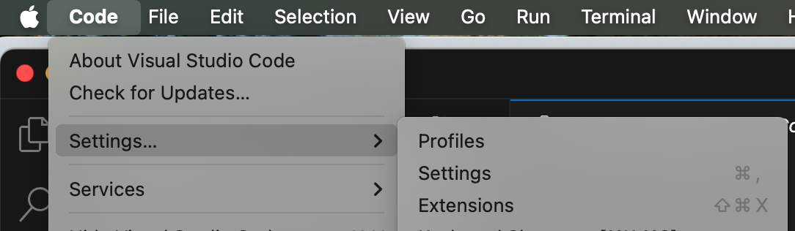

# interactive-narrative-template

This project contains everything you need to get started on your first interactive narrative!

## Getting Started

### Setting up Git on your local machine

Follow the instructions [here](https://docs.github.com/en/get-started/git-basics/set-up-git#setting-up-git) to set up Git on your command line, if you aren't already set up with Git.

Complete the sections titled, "Setting up Git" and "Authenticating with GitHub from Git." You do not need to complete anything in the "Next steps" section. 

You can authenticate via HTTPS or SSH. If this is your first time setting up Git, we recommend you authenticate via HTTPS (if you're already set up to authenticate via SSH, that's alright!).

### Downloading and setting up VSCode
You will need Visual Studio Code for this project. Find the right download for you machine [here](https://code.visualstudio.com/download) and install it before you continue. 

Then, open VSCode and install three extensions:
- [Svelte for VS Code](https://marketplace.visualstudio.com/items?itemName=svelte.svelte-vscode)
- [Prettier - Code formatter](https://marketplace.visualstudio.com/items?itemName=esbenp.prettier-vscode)
- [ESLint](https://marketplace.visualstudio.com/items?itemName=dbaeumer.vscode-eslint)

You can get to the extensions menu on a Mac by navigating to Code > Settings > Extensions. Search for each of the extensions listed above and install them.
https://docs.github.com/en/get-started/git-basics/set-up-git#authenticating-with-github-from-git

Make sure to quit and restart VSCode after installing extensions!

### Cloning and setting up the repo

1. Open a terminal window. Navigate to, or create, a directory (folder) where you want to keep your coding projects. For example:

```bash
cd           # navigates to your home user directory
mkdir code   # creates a new directory called code in your home user directory
cd code      # navigate into the new `code` directory
```

2. Clone the repository

```bash
git clone https://github.com/jasminesamra/interactive-narrative-template
cd interactive-narrative-template
```

3. Run the setup script [TODO: update this with Windows instructions]

```bash
scripts/setup_mac.sh
```

4. If all goes well, you will see the following message in your terminal (at the end of a list of other messages). If you don't see this message, reach out in the Discord for help!

```
🎉 Setup complete! Please restart your terminal window before continuing. 🎉
```

5. Check that everything was installed correctly by running tests:

```bash
npm run test
```

## Deployment

[TODO]

## Built With

[TODO]

## License

This project is licensed under the MIT License - see the [LICENSE.md](LICENSE.md) file for details

## Acknowledgments

[TODO]
